<h1 align="center">Maruf Online BD Notes</h1>

- [1. Existing Month File Operation:](#1-existing-month-file-operation)
  - [1.1. Net Bill Sheet (month-year):](#11-net-bill-sheet-month-year)
  - [1.2. Dish Bill Sheet (month-year):](#12-dish-bill-sheet-month-year)
  - [1.3. Reseller Sheets (month-year):](#13-reseller-sheets-month-year)
  - [1.4. Dhour Bill Sheet (month-year):](#14-dhour-bill-sheet-month-year)
  - [1.5. Cost File (month-year):](#15-cost-file-month-year)
  - [1.6. Other Cash In (month-year).xlsx:](#16-other-cash-in-month-yearxlsx)
  - [1.7. Band-Width Bill (month-year):](#17-band-width-bill-month-year)
  - [1.8. হাউজের হিসাব (month-year).xlsx:](#18-হাউজের-হিসাব-month-yearxlsx)
- [2. New Months File Creation:](#2-new-months-file-creation)

# 1. Existing Month File Operation: 

## 1.1. Net Bill Sheet (month-year):

## 1.2. Dish Bill Sheet (month-year):

## 1.3. Reseller Sheets (month-year):

## 1.4. Dhour Bill Sheet (month-year):

## 1.5. Cost File (month-year): 
There are only 1 steps to entry Cost File:
1. Fill the proper information in the `All Staffs (July-26).xlsx, Office (July-26).xlsx, Owner's (July-26).xlsx, Owner's Home (July-26).xlsx, Staffs (July-26).xlsx` sheets based on the `sabbir bhai` register notepad.
   - 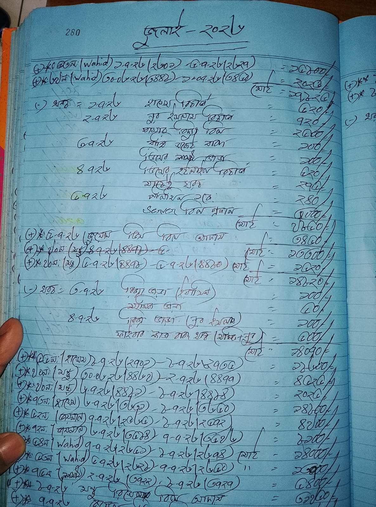
   - 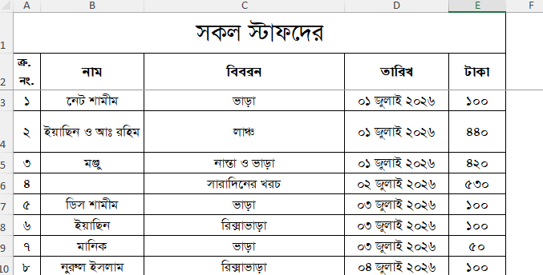 
   - 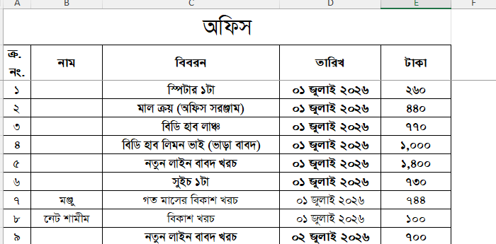
   - 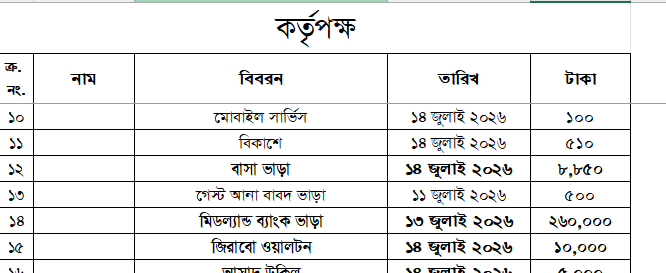
   - 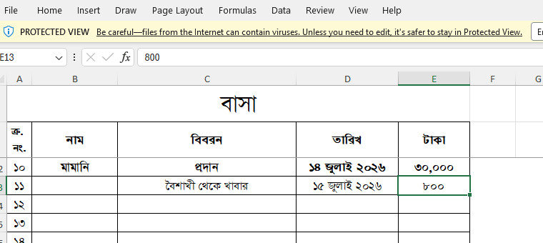
   - 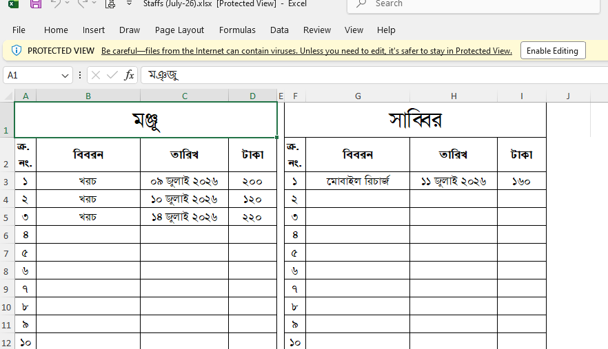
## 1.6. Other Cash In (month-year).xlsx:
There are only 1 steps to entry Other Cash In:
1. Fill the proper information in the `Other Cash In (month-year).xlsx` sheet
   - 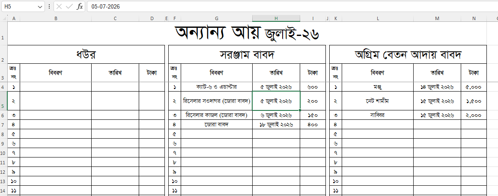

## 1.7. Band-Width Bill (month-year):
There are 3 steps to pay bandwidth bill to bd hub:
1. Fill the Midland Bank 2 page transaction form with the correct details: 
   - 

2. Fill the proper information in the `bdHub (month-year).xlsx` sheet
   - 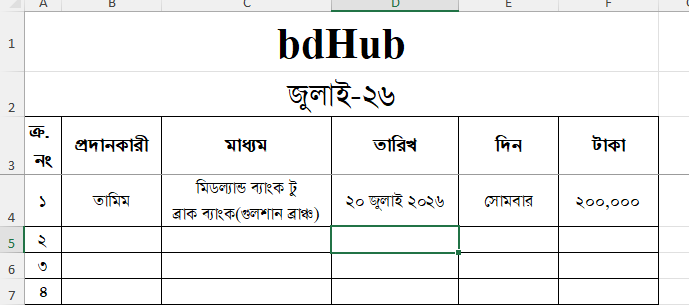

3. Scan and store the Midland bank 2 page filled transaction form for future reference.
   - 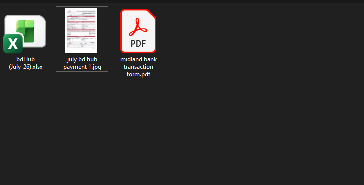

## 1.8. হাউজের হিসাব (month-year).xlsx: 
There are only 1 steps to entry হাউজের হিসাব:
1. Fill the proper information in the `হাউজের হিসাব (month-year).xlsx` sheet based on the `care-taker` information.
   - 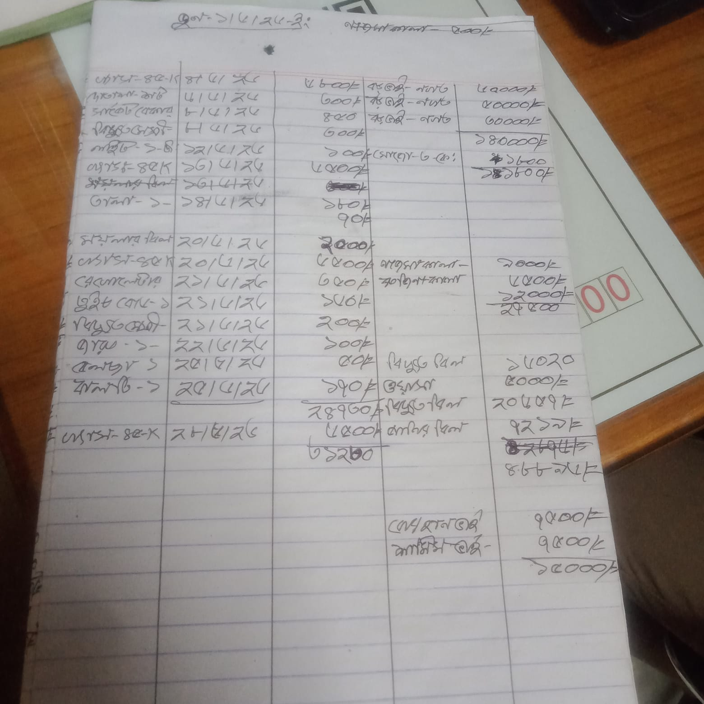
   - 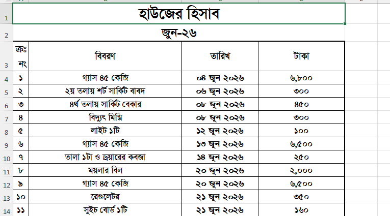

# 2. New Months File Creation: 
