<h1 align="center">Maruf Online BD Notes</h1>

- [1. Existing Month File Operation:](#1-existing-month-file-operation)
  - [1.1. Net Bill Sheet (month-year):](#11-net-bill-sheet-month-year)
    - [1.1.1. Case 1: Entry Money Receipt:](#111-case-1-entry-money-receipt)
    - [1.1.2. Case 2: Completely off User:](#112-case-2-completely-off-user)
    - [1.1.3. Case 3: Off User for 1 Month:](#113-case-3-off-user-for-1-month)
    - [1.1.4. Case 4: Change User Information:](#114-case-4-change-user-information)
  - [1.2. Dish Bill Sheet (month-year):](#12-dish-bill-sheet-month-year)
  - [1.3. Reseller Sheets (month-year):](#13-reseller-sheets-month-year)
    - [1.3.1. Step 1: Reseller Bill - Full Details (month-year).xlsx:](#131-step-1-reseller-bill---full-details-month-yearxlsx)
    - [1.3.2. Step 2: Reseller Net Bill (month-year).xlsx:](#132-step-2-reseller-net-bill-month-yearxlsx)
    - [1.3.3. Step 3 IP: Tagor, Shoudagor, kajol:](#133-step-3-ip-tagor-shoudagor-kajol)
      - [1.3.3.1. Tagor:](#1331-tagor)
      - [1.3.3.2. Shoudagor:](#1332-shoudagor)
      - [1.3.3.3. Kajol:](#1333-kajol)
    - [1.3.4. Step 4 MAC: Mostofa, Mahi, Khokon, Younus:](#134-step-4-mac-mostofa-mahi-khokon-younus)
      - [1.3.4.1. Mostofa:](#1341-mostofa)
      - [1.3.4.2. Mahi:](#1342-mahi)
      - [1.3.4.3. Khokon:](#1343-khokon)
      - [1.3.4.4. Younus:](#1344-younus)
  - [1.4. Dhour Bill Sheet (month-year):](#14-dhour-bill-sheet-month-year)
  - [1.5. Cost File (month-year):](#15-cost-file-month-year)
  - [1.6. Other Cash In (month-year).xlsx:](#16-other-cash-in-month-yearxlsx)
  - [1.7. Band-Width Bill (month-year):](#17-band-width-bill-month-year)
  - [1.8. হাউজের হিসাব (month-year).xlsx:](#18-হাউজের-হিসাব-month-yearxlsx)
- [2. New Months File Creation:](#2-new-months-file-creation)

# 1. Existing Month File Operation: 

## 1.1. Net Bill Sheet (month-year):
### 1.1.1. Case 1: Entry Money Receipt:

1. Fill the proper information in the `Net - Collection Sheet (month-year).xlsx` based on the `money receipt`.
   - 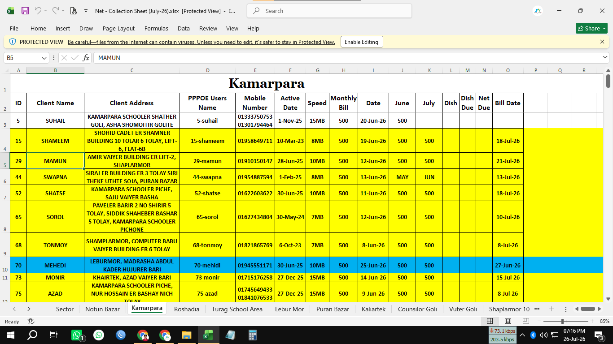
2. Fill the proper information in the `Net (month-year).xlsx` based on the `money receipt` 
   - 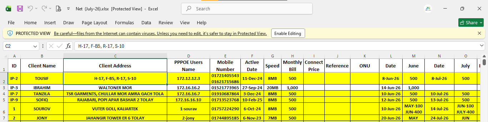
3. In the software, go the the `Manage Billing --> Manage Pending bill`. Then search with the `User ID`. After that fill the form with proper information based on the `money receipt`
   - 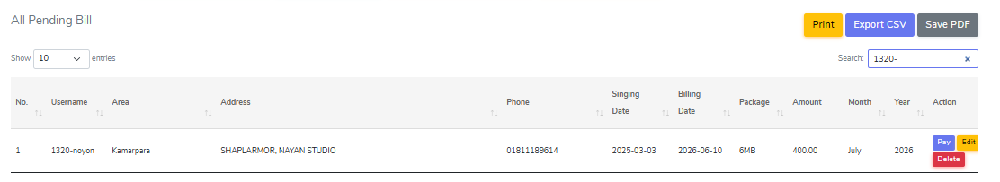

### 1.1.2. Case 2: Completely off User:
1. Fill teh row with red color and just clear the content of `monthly bill` cell from both `collection sheet` and `main sheet` sheets.
2. Inform it to `Monju Bhai` and when the new users added to that `id` then fill the proper new user information form both `collection sheet` and `main sheet` sheets. 
3. Delete teh old user data from the software and add the new user data in the software.     

### 1.1.3. Case 3: Off User for 1 Month:
1. Fill the row with brown color and just clear the content of `monthly bill` cell from both `collection sheet` and `main sheet` sheets only for that month.
2. Inform it to `Monju Bhai` and he will off the user for 1 month from the server.
3. Enter the user `Id` and `description` to the `Notes about line.xlsx` sheet.
   - 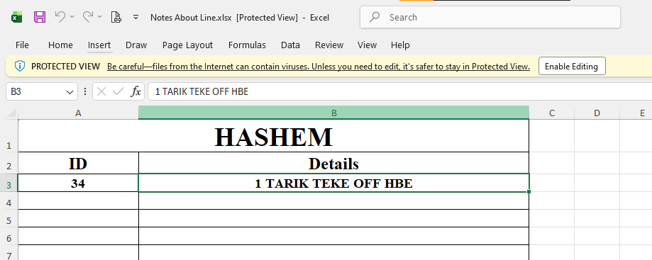   

### 1.1.4. Case 4: Change User Information: 
1. update the proper information from `collection sheet, main sheet and software`.

## 1.2. Dish Bill Sheet (month-year):
1. Entry the proper information in the `Full Dish - Collection Sheet (July-26).xlsx` sheet based on the dish bill `money receipt`.
   - 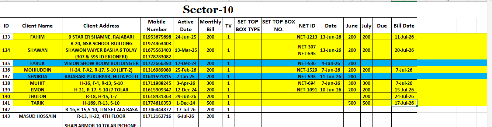
2. After collection man give the `Full Money Receipt` book then total dish bill collection info on the `Dish Collection Sammary Sheet (July-26).xlsx` sheet.
   - 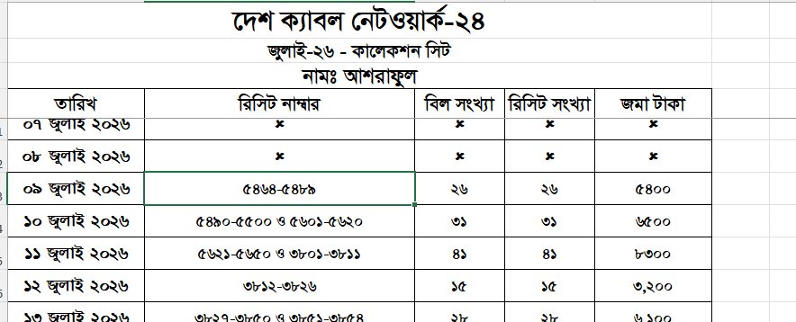

## 1.3. Reseller Sheets (month-year):

### 1.3.1. Step 1: Reseller Bill - Full Details (month-year).xlsx: 
1. Entry the proper information in the `Reseller Bill - Full Details (month-year).xlsx` sheet based on the `money receipt`.
   - 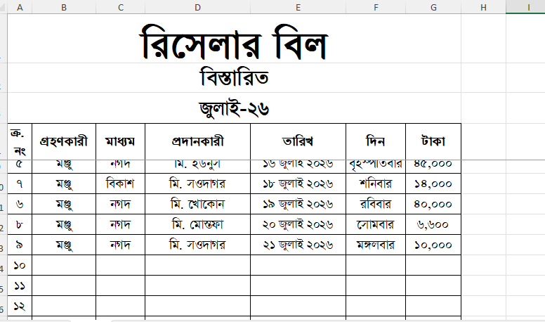

### 1.3.2. Step 2: Reseller Net Bill (month-year).xlsx:
1. Entry the Total amount of TK collected from `Reseller Bill - Full Details (month-year).xlsx` sheet to the `Reseller Net Bill (month-year).xlsx` sheet specific cells like `তারিখ(updated date), রানিং মাসে বিল এসেছে (updated tk after sum), সর্বমোট বিল দিয়েছে(updated tk after sum)`
   - 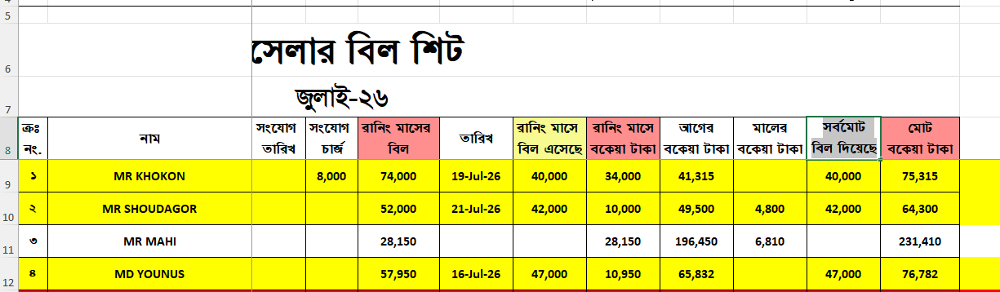

Note: If `monju bhai` ask for reseller sheet then we must send them the sheet after deleting `PPPOE, সংযোগ তারিখ, সংযোগ চার্জ` and hiding `সর্বমোট বিল দিয়েছে`:
- 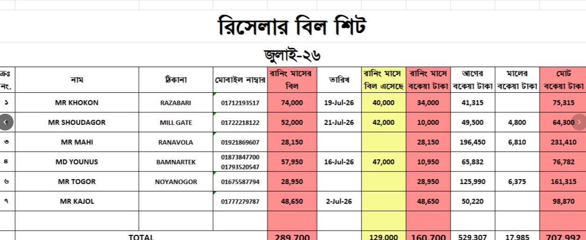

### 1.3.3. Step 3 IP: Tagor, Shoudagor, kajol: 
#### 1.3.3.1. Tagor: 
1. Entry the proper ip name and speed in the `Mr. Togor (IP Names & Speed).xlsx` sheet based on the `microtik server`
   - 
2. Entry the proper information in the `Mr. Togor's Taken Accessories (July-26).xlsx` sheet based on the `money receipt` if **applicable**
   - 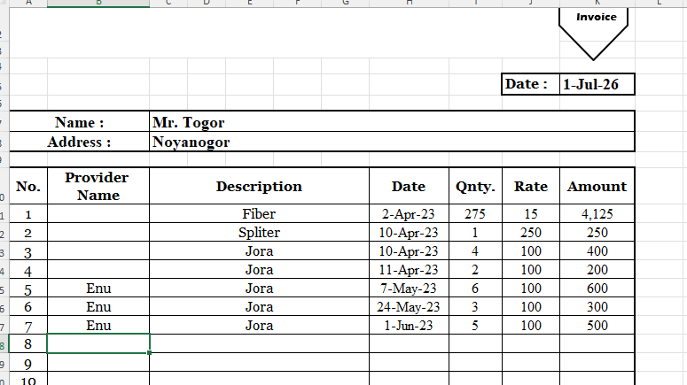
3. Entry the proper information in the `Mr. Togor (July-26).xlsx` sheet based on the `Reseller Net Bill (July-26).xlsx` and `Mr. Togor's Taken Accessories (July-26).xlsx` sheets.
   - 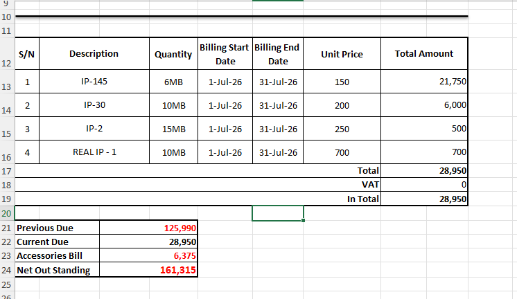
**here,** 
   - add `Previous Due` based on `আগের বকেয়া টাকা` in `reseller net bill (month-year).xlsx` sheet.
   - add `Current Due` based on `রানিং মাসে বকেয়া টাকা` in `reseller net bill (month-year).xlsx` sheet and sync it with the `Mr. Togor (month-year).xlsx`.
   - add `Accessories Bill` based on `Mr. Togor's Taken Accessories (month-year).xlsx` sheet.
   - add `Net Out Standing` based on `মোট বকেয়া টাকা` in `reseller net bill (month-year).xlsx` sheet.
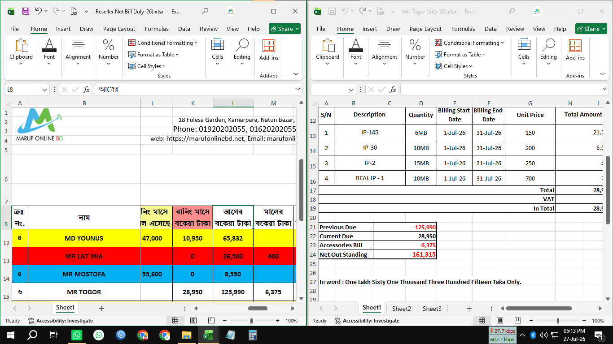

#### 1.3.3.2. Shoudagor: 
1. same as `Tagor`
2. same as `tagor`
3. Entry the proper information in the `Mr. Shoudagor (July-26).xlsx` sheet based on the `Reseller Net Bill (July-26).xlsx` and `Mr. Shoudagor's Taken Accessories (July-26).xlsx` sheets.
   - 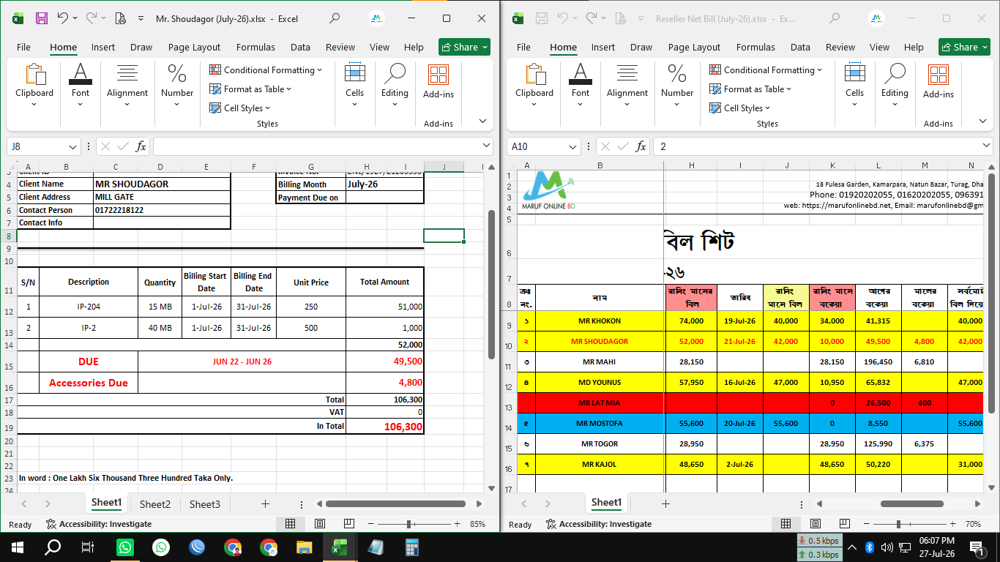

**here,**
   - Verify the `Total Amount` based on `Reseller Net Bill (month-year).xlsx` sheet.
   - add `DUE - JUN 22 - JUN 26` based on `Reseller Net Bill (month-year).xlsx` sheet `আগের বকেয়া টাকা` cell.
   - add `Accessories Due` based on `Mr. Shoudagor's Taken Accessories (month-year).xlsx` sheet.
   - Verify `In Total` based on `Reseller Net Bill (month-year).xlsx` sheet `মোট বকেয়া টাকা` cell
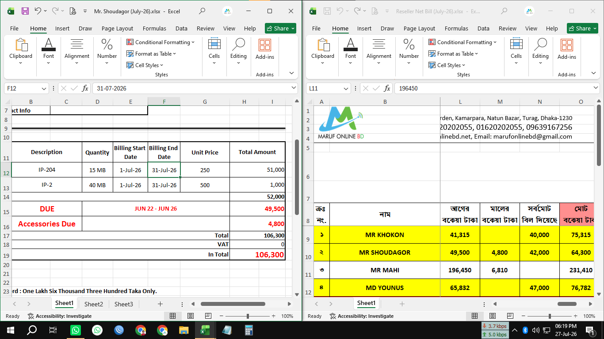
#### 1.3.3.3. Kajol: 
**Same as `Tagor`**

### 1.3.4. Step 4 MAC: Mostofa, Mahi, Khokon, Younus:
#### 1.3.4.1. Mostofa: 
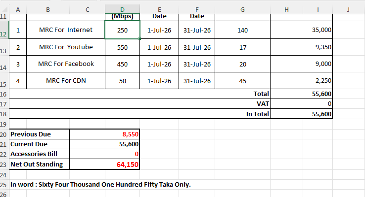
1. verify `In Total` and based on `Reseller Net Bill (month-year).xlsx` sheet `রানিং মাসের বিল` cell
2. add `Previous Due` based on `Reseller Net Bill (month-year).xlsx` sheet `আগের বকেয়া টাকা` cell.
3. add `Current Due` based on `Reseller Net Bill (month-year).xlsx` sheet `রানিং মাসে বকেয়া টাকা` cell.
4. add `Accessories Bill` based on `Mr. Mostofa's Taken Accessories (month-year).xlsx` sheet if **applicable**.
5. add `Net Out Standing` based on `Reseller Net Bill (month-year).xlsx` sheet `মোট বকেয়া টাকা` cell.
#### 1.3.4.2. Mahi: 
**Same as `Mostofa`**
#### 1.3.4.3. Khokon:
**Same as `Mostofa`**
#### 1.3.4.4. Younus:
**same as `Mostofa`**

## 1.4. Dhour Bill Sheet (month-year):
1. Entry the proper information in the `Dhour Net Bill Sheet (July-26).xlsx` based on `MicroTik Server`.
2. Add the `Total Monthly Amount` from the `Dhour Net Bill Sheet (July-26).xlsx` to the `Md. Borkot (July-26).xlsx` sheet `Net Bill` cell after dividing it by 2 (half) of the total amount.
   - 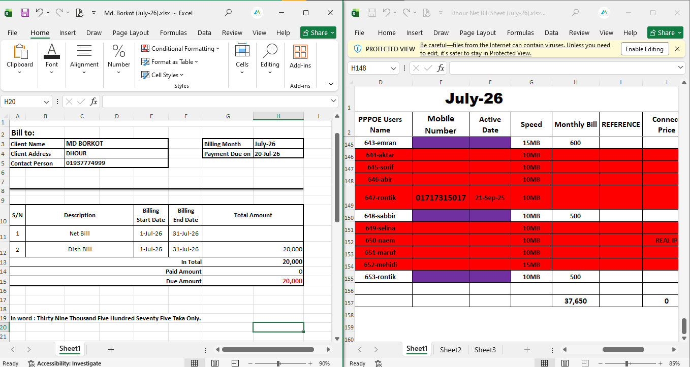
- add the `Total Monty Amount` from the `Dhour Net Bill Sheet (July-26).xlsx` to the `ধউরের সম্পূর্ণ হিসাব (জুলাই-২৬ পর্যন্ত).xlsx` sheet `জুলাই-এর নেট বিল - ২৬` cell after dividing it by 2 (half) of the total amount and add total paid money from the `Other Cash In  (July-26).xlsx` to `জুলাই-২৬-এর বিল দিয়েছে মার্চেন্ট বিকাশে` cell. 
  - 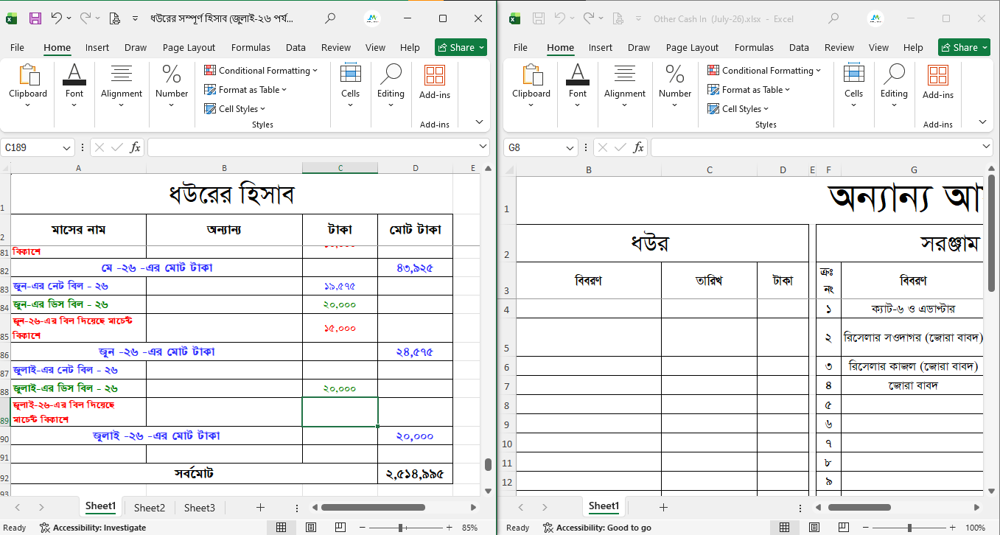
## 1.5. Cost File (month-year): 
There are only 1 steps to entry Cost File:
1. Fill the proper information in the `All Staffs (July-26).xlsx, Office (July-26).xlsx, Owner's (July-26).xlsx, Owner's Home (July-26).xlsx, Staffs (July-26).xlsx` sheets based on the `sabbir bhai` register notepad.
   - 
   -  
   - 
   - 
   - 
   - 

 ## 1.6. Other Cash In (month-year).xlsx:
There are only 1 steps to entry Other Cash In:
1. Fill the proper information in the `Other Cash In (month-year).xlsx` sheet
   - 

Note: For entry `অগ্রিম বেতন আদায় বাবদ` cells we must need to follow `sabbir bhai` register notepad.

## 1.7. Band-Width Bill (month-year):
There are 3 steps to pay bandwidth bill to bd hub:
1. Fill the Midland Bank 2 page transaction form with the correct details: 
   - 

2. Fill the proper information in the `bdHub (month-year).xlsx` sheet
   - 

3. Scan and store the Midland bank 2 page filled transaction form for future reference.
   - 

## 1.8. হাউজের হিসাব (month-year).xlsx: 
There are only 1 steps to entry হাউজের হিসাব:
1. Fill the proper information in the `হাউজের হিসাব (month-year).xlsx` sheet based on the `care-taker` information.
   - 
   - 

# 2. New Months File Creation: 
